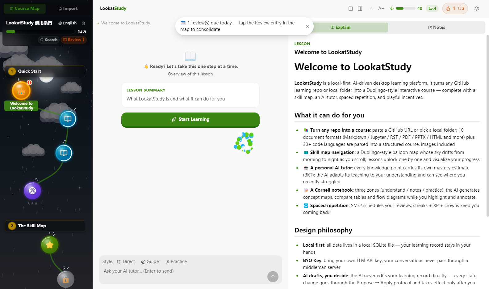
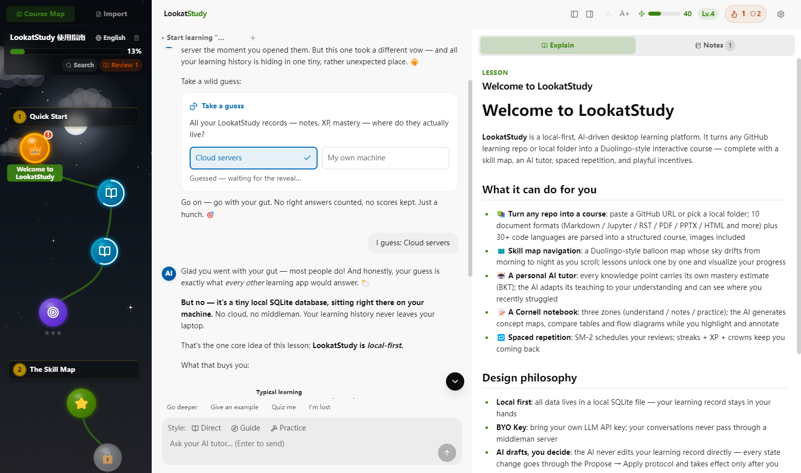
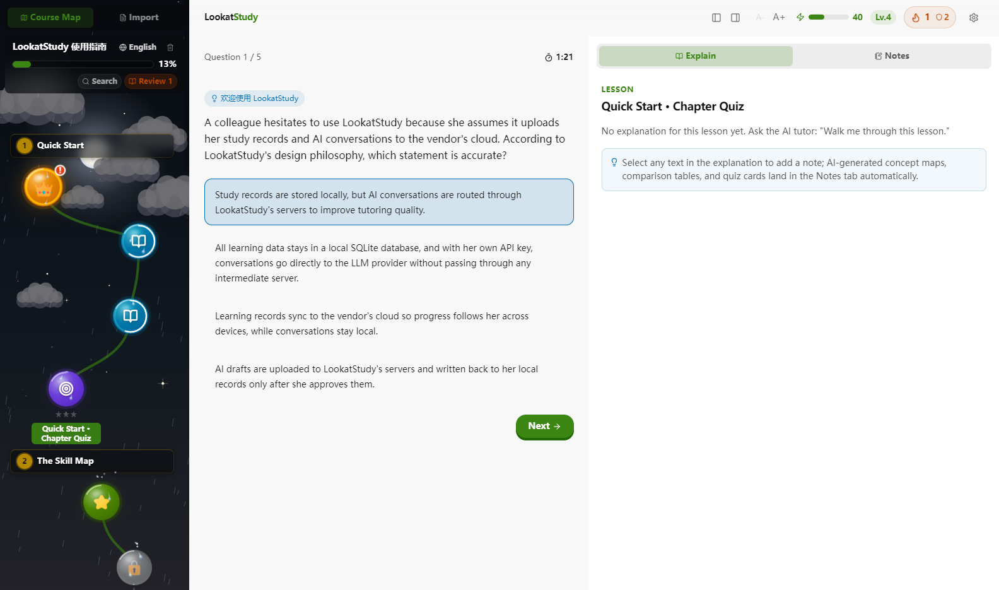

<div align="center">

# LookatStudy

Turn almost anything into a course you actually finish

I star a lot of tutorials and finish almost none of them, so I built this for myself. A repo, a folder, a link, or a recording comes in, a gated course comes out, and an AI tutor keeps track of what you've really learned. Everything runs on your machine, with your own API key.

[](LICENSE)
[](https://github.com/Kaiji-Z/LookatStudy/releases)
[](#getting-started)



**English** | [简体中文](README.zh-CN.md)

</div>

---

## Why I built this

Every few weeks I'd star another roadmap, clone a tutorial repo, read the intro, and quietly never come back. This kept happening, and blaming willpower never fixed it. A pile of docs is missing things every course has.

Pick up a course and you know what to study today. Three hundred files in a repo give you no such answer. Finish a lesson and a quiz tells you whether it landed. Finish a doc and you're left guessing. A course brings material back before you forget it, and it gives you a reason to open it again tomorrow. A browser tab does neither.

Duolingo solved these problems thoroughly, but only for its own content. I wanted the same mechanics on material I chose. Give LookatStudy a repo, a folder, a link, or a recording, and it builds a gated course with exams and a review schedule.

## The repo becomes a skill map

Sections and lessons turn into nodes on a path. Finish one and the next unlocks. Finishing a lesson takes more than reading it. Each lesson breaks into knowledge points, and your mastery of the lesson is the lowest of them. Leave one point vague and the crown stays locked. Imports get big, one repo I test with lands at 124 lessons, and the search pill in the left rail doubles as a clickable outline for exactly that case, searching titles and full text, keeping locked lessons unspoiled.

## The AI tutor knows which concept you're weak on



This is the part I care most about. Every answer you give updates a BKT mastery model on the specific knowledge point behind the question. The tutor sees far more than "chapter 3, 70 percent". You're solid on recursion and shaky on closures, so it keeps asking about closures. When you click "I don't get this" in a chat, the stumble gets logged, and later explanations spend more time where you actually fell and less where you're already bored.

Two design decisions I made on day one and haven't regretted.

The AI cannot touch your learning record on its own. It drafts a proposal card, and nothing changes until you approve it.

Teaching style is a pill next to the input box, switchable anytime. Explain it to me straight, ask me guiding questions, or make me do it myself.

Chats run async. Mid-answer you can jump to another lesson and ask something new there. The first reply keeps building in the background, its thread tab and its node on the map wear a small spinner, and the whole thing is waiting when you come back. Two threads can stream at once.
## Chapter exams are boss fights



Each chapter ends with an exam guarding the gate. The questions are generated in the background from that chapter's knowledge points, in batches, while you keep studying elsewhere, and a toast tells you when the boss is ready. Every question runs on a countdown sized to the question itself, so a short one doesn't drag and a wall of text or code gets room to breathe. Walk away mid-exam and the attempt terminates, with unanswered questions counted wrong, so the star score stays honest. The result page breaks your score down by knowledge point, which tells you what to review next. One rule I hold to, exams never write back into the mastery model. They measure. The tutor teaches.

## What you can import

- Five ways in. A GitHub URL, a local folder, any web article, arXiv paper, or video link, text you paste, an EPUB book.
- Eleven document formats. `.md` `.ipynb` `.rst` `.Rmd` `.org` `.adoc` `.pdf` `.pptx` `.html` `.txt` `.epub`.
- Thirty-odd code file types. `.py` `.ts` `.go` `.rs` `.java` `.c` `.cpp` `.sh` all count as teaching material, and docstrings become the prose.
- Audio becomes lessons. Local recordings in `.mp3` `.m4a` `.flac` and other common formats get transcribed on your machine by Whisper and split into lessons, so a folder of lecture recordings lands as a multi-episode course.
- Video too. Bilibili links pull the audio track directly, YouTube and a thousand other sites go through yt-dlp with subtitles preferred over transcription, and local `.mp4` `.m4v` `.mov` files have their audio extracted here. A multi-part Bilibili course imports as a whole season, one part per lesson. yt-dlp is a local install with in-app instructions, and mkv or webm want a quick rewrap to mp4 first.
- Images ride along with the content, notebook outputs and PDF embeds included. With a vision model, the tutor actually looks at the figure when you ask about it.
- Bilingual sources pair up automatically. A `translations/{lang}/` folder, parallel folders, or `file.zh.md` suffixes all get recognized.

Math formulas work end to end. LaTeX in any lesson, chat reply, or quiz question renders as typeset math, read-aloud says formulas in spoken words instead of backslash commands, and the exercise generator is told it may use LaTeX freely. Importing a formula-heavy PDF has a new experimental path: math-dense pages get rendered to images and your vision model transcribes them to LaTeX, behind a switch in settings.

## It reads out loud and takes dictation

A lesson can be read to you end to end, sentence by sentence, with the sentence being spoken highlighted in the text. The default voice is a free online one, an offline neural voice can be downloaded for no-network use, and the voices already installed on your device are selectable too. Dictation runs the other way. Hold the mic button, speak, release, and local Whisper writes it down, with a chance to fix the transcript before it goes out. Everything works offline once the models are down, on the phone as well.

## A small bot lives in the app

A tiny robot shares the study with you. It hovers around the skill map on real physics, a thrown ball can knock it into a spin, and it leans into the wind when the weather turns. It reacts to what you do. The keys you type light up on its chest screen, during read-aloud it points at the sentence being spoken, and a click on empty map space whistles it over to wave at you. Five bodies to pick from, and when you're heads-down working it retreats behind a curtain and leaves you alone.

## The part that makes you come back

Answer a quiz and SM-2 schedules a review right before you'd forget it. Daily XP fills a bar in the header. Streaks can be frozen, so one broken day doesn't zero you out. The review drawer mixes chapters instead of drilling one. I know how this sounds on a project page. I was skeptical too, but it genuinely works, and the difference is that here it hangs on content you picked yourself.

## Your data stays on your machine

The whole app is one SQLite file on your disk. No account, no cloud sync, and nothing you do here ever leaves that drive. The LLM key is your own, with nineteen preset providers (GLM, DeepSeek, Kimi, Qwen, OpenAI, Anthropic, Google, and more) plus any OpenAI-compatible endpoint. The key lives in the main process. The renderer can't read it even if it wanted to.

## Getting started

Installers for all three platforms are on the [Releases](https://github.com/Kaiji-Z/LookatStudy/releases) page. Windows gets an NSIS installer, macOS an arm64 dmg, Linux an AppImage plus a deb.

From source, any platform, Node 22 or newer.

```bash
git clone https://github.com/Kaiji-Z/LookatStudy.git
cd LookatStudy
npm install
npm run dev:electron
```

A guide course ships built in, six chapters, eighteen lessons, six exams, so you can click through the whole loop without a key. It is bilingual too, Chinese original with a full English translation, so the globe switch on the map title card works from minute one. To bring the AI in, open Settings, pick a provider, paste your key, hit Test Connection, save.

## Running it on a phone

The desktop app is the main form. There is also a phone path, and it reuses everything, same interface, same data file, same AI.

Grab `LookatStudy-launcher.apk` from the latest [Release](https://github.com/Kaiji-Z/LookatStudy/releases) and install it. Its first button installs Termux, which it carries inside, so no store needed. The second button copies one command. Paste it into Termux and it downloads the portable bundle together with the speech engine, installs Node, and starts the server. The Open button then drops you into the app in Chrome. The first startup prints an access token in Termux; type it into the page once and it sticks.

The phone runs the server itself and Chrome talks to it over localhost, so your data stays on the phone the way it stays on your PC. No npm runs on the phone. The bundle download prefers a China friendly npm mirror and falls back to GitHub when the mirror lags. The server is one self-contained file plus the web assets. Skip the launcher if you like, the same one line works in any Termux.

## What it can't do yet

- The macOS build is unsigned and Apple Silicon only. First launch needs a right-click and Open, and there's no Intel package yet. The Windows exe is unsigned too, so SmartScreen will grumble the first time.
- PDF math formulas don't survive the text layer, and that limit stays. The experimental switch described above is the way around it, and it needs a vision model configured plus its quota, page by page. Off by default, and when it's off or fails, the PDF imports through the plain text layer as before.
- The smart part of importing, classifying files and designing the course tree, calls the LLM. Without a key, local imports fall back to pure rules. It works, just blunter.

## Under the hood

Electron 33, React 19. The database is sql.js, SQLite compiled to WASM, so there's nothing native to build and `npm install` doesn't blow up on Windows. The renderer can't reach the database, the filesystem, or your key. Every cross-process call goes through one typed IPC bridge. A hundred and nine deterministic test suites and a headless real-GUI test watch the whole thing, all runnable with `npm run verify:core`.

## Status

v0.23.0. The main loop, importing almost anything, learning with the tutor, reviewing, taking exams, reading aloud, is complete, and I use it daily. Full history in [CHANGELOG.md](CHANGELOG.md).

## License

MIT. See [LICENSE](LICENSE).

---

<div align="center">

If LookatStudy helps you finish something you've been putting off, a star would make my day.

</div>
