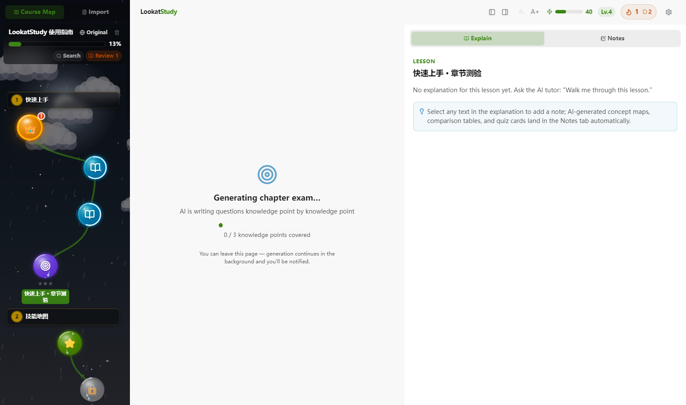

<div align="center">

# LookatStudy

把几乎任何东西变成一门你能学完的课程

我 star 过很多教程,真正学完的没几个,这个工具是我给自己写的解法。仓库、链接、文件夹或者一段录音进来,都变成一节节解锁的课,AI 导师盯着你到底懂没懂。全部跑在你自己电脑上,大模型 key 也用你自己的。

[](LICENSE)
[](https://github.com/Kaiji-Z/LookatStudy/releases)
[](#快速开始)


[English](README.md) | **简体中文**

</div>

---

## 我为什么写这个

我隔几周就会 star 一个新的 roadmap,克隆一个教程仓库,读完开头,然后就没有然后了。这事反复发生,自责解决不了。文档本来就缺几样课程才有的东西。

拿起一门课,你知道今天该学哪一节。三百个文件躺在仓库里,这个问题没有答案。读完一节,课后题会告诉你到底懂没懂。读完一篇文档,只能自己猜。课程会赶在你忘掉之前把旧内容塞回来,文档读一遍就翻篇了。第二天为什么还要再打开它,课程有理由,标签页没有。

多邻国把这四件事解决得很彻底,可惜只对它自己的内容有效。我就想把同样的机制装到自己选的材料上。给 LookatStudy 一个仓库、一个文件夹、一条链接、一段录音,或者直接贴一段文本,它生成一门有门控、有考试、有复习计划的课。

## 仓库会变成一张技能地图

章节和课时变成路上的节点,学完一个,下一个解锁。一节课要算学完,标准比读过一遍高不少。每节课拆成若干知识点,课的掌握度取其中最低的那个,有一项含糊,皇冠就拿不到。课可以很大,我测试用的一个仓库导出来 124 节课,这时左栏的搜索药丸兼作全课大纲,标题全文都搜,没解锁的课照样锁着,不剧透。

## AI 导师知道你具体哪里弱


这是我最在意的一块。每答一道题,答案都会更新对应知识点的 BKT 掌握模型。导师能看到比第三章 70% 细得多的东西。递归你很稳,闭包还发虚,它就专挑闭包问。你在聊天里点过"我没太懂",这些卡点会被记下来,后面的讲解会绕开你已经烦的地方,多讲你实际摔跟头的地方。

有两个设计是我一开始就定下的,到现在也没后悔。

AI 想改你的学习档案,唯一的途径是发一张提议卡,你点批准才生效,它自己动不了。

教学风格随时换。输入框旁边有个人设药丸,精讲、引导、实战三种,今天想被直接告知就选精讲,想被追问就选引导。

对话是异步的。回答写到一半也能跳去别的课时另起一段提问。原来那段回答在后台继续写,它的会话标签和地图球上转着小圈,回来时整段都在。两个会话可以同时流式。

## 章节考试是 Boss 战



每章末尾有一场考试守门。题目按这一章的知识点在后台分批生成,你在别处接着学,生成完会弹提示告诉你 Boss 就绪。每道题都踩着倒计时,时长按题目本身算,短题不拖沓,长题干带代码公式的给足。中途走开,这次考试就算被终止,没答的题按答错计分,星数不作假。结算页把得分按知识点拆开,该复习什么一目了然。有一条规矩我守得很死,考试不回写掌握度模型,它只管测,教是导师的事。

## 能导入什么

- 五种入口。GitHub 链接、本地文件夹、网页文章或 arXiv 论文或视频链接、直接粘贴的文本、EPUB 电子书。
- 十一种文档格式。`.md` `.ipynb` `.rst` `.Rmd` `.org` `.adoc` `.pdf` `.pptx` `.html` `.txt` `.epub`。
- 三十多种代码文件。`.py` `.ts` `.go` `.rs` `.java` `.c` `.cpp` `.sh` 都算教材,docstring 会被抽出来当正文讲。
- 音频也能成课。本地的录音,`.mp3` `.m4a` `.flac` 这些常见格式,在本机用 Whisper 转写成文字再按内容拆课,一整个文件夹的讲次录音进来,就是一门多集课。
- 视频也行。B站链接直接拉音轨,YouTube 等上千个站点走 yt-dlp,有现成字幕就用字幕,没有才下载音轨转写;本地 `.mp4` `.m4v` `.mov` 取音轨转写。B站多分P的课程链接一导入就是整季,每P一集。yt-dlp 要自己装,应用里给了各平台的指引,mkv 和 webm 先转成 mp4 再进来。
- 图片跟着内容一起进来,notebook 的输出图、PDF 的内嵌图都在。如果你的模型带视觉,你问图表的时候它真的在看图。
- 双语来源自动配对。`translations/{lang}/` 目录、平行文件夹、`file.zh.md` 后缀这三种常见摆法都能认出来。

数学公式从显示到朗读到做题都顺了。课文、AI 回答、题目里的 LaTeX 都渲染成排版公式,朗读时把公式念成人话而不是反斜杠命令,出题也放开了 LaTeX。导入公式密集的 PDF 也有了新的实验路径,把数学页整页渲染成图,由你的视觉模型转写成 LaTeX,开关在设置里,默认不开。

## 它会念给你听,也能听你说

课文可以整篇朗读,读到哪句就高亮哪句。默认走免费在线音色,也可以下载一个完全离线的神经音色,断网照读,设备上已经装好的语音同样能选。反过来的方向是听写,按住说话,松手出全文,认出的字先给你改一遍再发出去。模型下载好之后推理全程离线,手机上同样能用。

## 有个小机器人陪你学

一只小机器人跟你共用这间书房。它悬在左栏的技能地图上,底下是真物理,扔个球过去能把它拍晕,刮风下雨它也跟着晃。你打字,敲下的字母就亮在它胸前的屏幕上,整篇朗读时它跟指着正在读的那一句,点一下地图空白处,它会飞过来朝你挥挥爪。五个身体随便换,你埋头学的时候它自己躲进纱帘,不来抢戏。

## 让人回来的那套东西

答对一道题,SM-2 会赶在你快忘的时候把它排进复习。每天的经验值在顶栏攒成一根能量条,连续学习可以冻结,断一天不至于清零。复习抽屉把不同章节的旧内容混着出,比按章刷更抗忘。我知道这套东西在一个正经项目页里听起来像哄小孩。我自己一开始也怀疑,真用起来发现确实管用,差别在于这里挂的是你自己选的内容。

## 数据都在你自己机器上

整个应用就是磁盘上的一个 SQLite 文件。不用注册账号,也没有云同步,你产生的数据没有一份会离开这块硬盘。大模型 key 用你自己的,预置了十九家服务商,GLM、DeepSeek、Kimi、Qwen、OpenAI、Anthropic、Google 都在,也可以填任何 OpenAI 兼容的端点。key 只存在主进程里,渲染进程想读也读不到。

## 快速开始

三个平台的安装包都在 [Releases](https://github.com/Kaiji-Z/LookatStudy/releases) 页。Windows 是 NSIS 安装器,macOS 是 arm64 的 dmg,Linux 有 AppImage 和 deb 两种。

源码跑,任何平台,Node 22 以上。

```bash
git clone https://github.com/Kaiji-Z/LookatStudy.git
cd LookatStudy
npm install
npm run dev:electron
```

应用内置了一门引导课程,六章十八课带六场考试,不配 key 也能把整个流程点一遍。这门课本身就是双语的,中文原文配全套英文翻译,地图标题卡上的 🌐 切换器从第一分钟就能玩。想用上 AI,打开设置,选服务商,粘贴 key,点测试连接,保存。

## 手机上也能跑

桌面版是主形态,手机也有一条路径,复用全部东西,同一个界面,同一份数据。

从最新 [Release](https://github.com/Kaiji-Z/LookatStudy/releases) 下载 `LookatStudy-launcher.apk` 装到手机。引导器第一个按钮装 Termux,APK 里自带,不用找应用商店。第二个按钮复制一行安装命令,粘贴进 Termux 执行,它会下载便携包和语音引擎、装好 Node、启动服务。第三个按钮直接把应用打开。首次启动 Termux 里会打印一个访问令牌,在页面输一次,之后长期记住。

手机自己跑服务,浏览器经 localhost 与它通信,数据像在电脑上一样留在本机。安装不会在手机上执行 npm,便携包的下载优先走国内 npm 镜像,镜像同步滞后或失败时自动回退 GitHub。服务是一个自包含文件加网页资源。不想用引导器也行,任何 Termux 里跑同一行命令即可。

## 目前做不到的事

- macOS 的包没有签名,只出 Apple Silicon 架构。首次打开要右键选打开,Intel Mac 的包还没出。Windows 的 exe 同样没签名,第一次运行 SmartScreen 会拦一下。
- PDF 的数学公式过不了纯文本层,这个局限一直都在。上面说的实验开关是绕开的路子,前提是配好视觉模型,并按页消耗它的额度。开关默认关,不开或者中途失败时,PDF 照旧按文本层导入。
- 智能导入,判文件角色、设计课程结构那部分,要调 LLM。没有 key 时本地导入退回纯规则,能用,结构会糙一些。

## 技术上

Electron 33,React 19。数据库用 sql.js,就是把 SQLite 编译成 WASM,没有任何要编译的原生模块,Windows 上装依赖不会翻车。渲染进程碰不到数据库、文件系统和 key,所有跨进程调用走一套类型化的 IPC 桥。109 个确定性测试套件加一个无头真 GUI 测试看着它,`npm run verify:core` 一条命令全跑。

## 状态

v0.23.0。导入、跟导师学、复习、考试这条主干完整,语音和伴学也都上了,我自己每天在用。完整历史看 [CHANGELOG.md](CHANGELOG.md)(英文)。

## 许可证

MIT,全文见 [LICENSE](LICENSE)。

---

<div align="center">

如果它帮你学完了一件一直拖着的事,给我一个 star,我会很开心。

</div>
