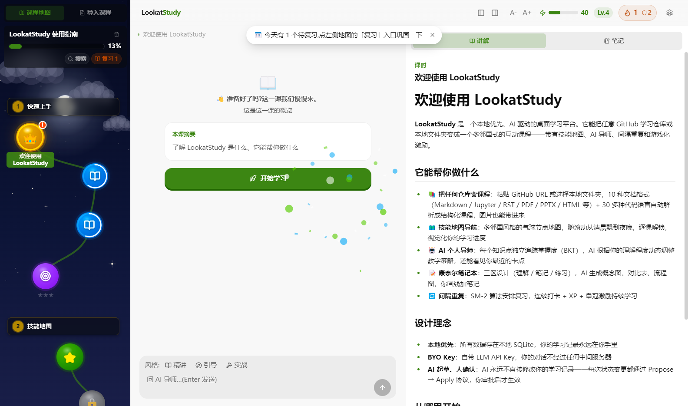
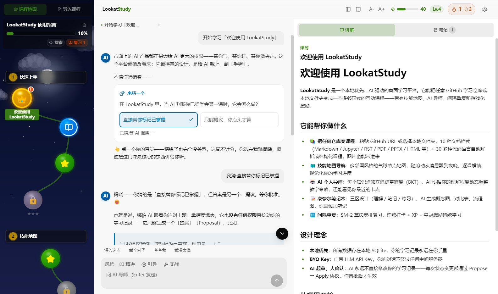
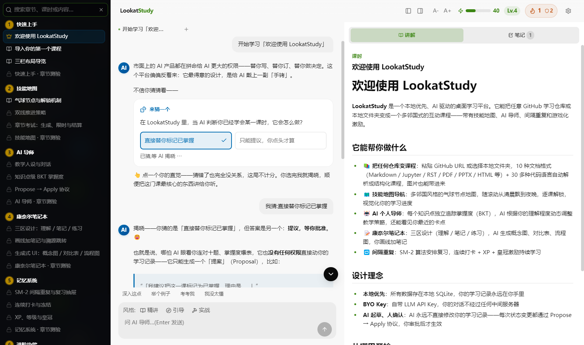

<div align="center">

# LookatStudy

把任意仓库变成一门你能学完的课程

我 star 过很多教程,真正学完的没几个,这个工具是我给自己写的解法。仓库进来变成一节节解锁的课,AI 导师盯着你到底懂没懂。全部跑在你自己电脑上,大模型 key 也用你自己的。

[](LICENSE)
[](https://github.com/Kaiji-Z/LookatStudy/releases)
[](#快速开始)



[English](README.md) | **简体中文**

</div>

---

## 我为什么写这个

我隔几周就会 star 一个新的 roadmap,克隆一个教程仓库,读完开头,然后就没有然后了。这事反复发生,自责解决不了。文档本来就缺几样课程才有的东西。

拿起一门课,你知道今天该学哪一节。三百个文件躺在仓库里,这个问题没有答案。读完一节,课后题会告诉你到底懂没懂。读完一篇文档,只能自己猜。课程会赶在你忘掉之前把旧内容塞回来,文档读一遍就翻篇了。第二天为什么还要再打开它,课程有理由,标签页没有。

多邻国把这四件事解决得很彻底,可惜只对它自己的内容有效。我就想把同样的机制装到自己选的材料上。给 LookatStudy 一个 GitHub 仓库、一个本地文件夹,或者直接贴一段 markdown,它生成一门有门控、有考试、有复习计划的课。

## 仓库会变成一张技能地图

章节和课时变成路上的节点,学完一个,下一个解锁。每章末尾有一场 Boss 考试,题目在后台按知识点生成,答题限时。一节课要算学完,标准比读过一遍高不少。每节课拆成若干知识点,课的掌握度取其中最低的那个,有一项含糊,皇冠就拿不到。

## AI 导师知道你具体哪里弱



这是我最在意的一块。每答一道题,答案都会更新对应知识点的 BKT 掌握模型。导师能看到比第三章 70% 细得多的东西。递归你很稳,闭包还发虚,它就专挑闭包问。你在聊天里点过"我没太懂",这些卡点会被记下来,后面的讲解会绕开你已经烦的地方,多讲你实际摔跟头的地方。

有两个设计是我一开始就定下的,到现在也没后悔。

AI 想改你的学习档案,唯一的途径是发一张提议卡,你点批准才生效,它自己动不了。

教学风格随时换。输入框旁边有个人设药丸,精讲、引导、实战三种,今天想被直接告知就选精讲,想被追问就选引导。

## 搜索能当大纲用



导入的课可以很大,我测试用的一个仓库导出来 124 节课。课多了地图滚起来很累,左栏的搜索面板就是为这个做的。它搜标题也搜全文,不输入关键词时显示整门课的目录树,点哪行跳哪课。没解锁的课在列表里照样锁着,不会剧透。

## 能导入什么

- 三种入口。GitHub 链接、本地文件夹、直接粘贴的 markdown。
- 十种文档格式。`.md` `.ipynb` `.rst` `.Rmd` `.org` `.adoc` `.pdf` `.pptx` `.html` `.txt`。
- 三十多种代码文件。`.py` `.ts` `.go` `.rs` `.java` `.c` `.cpp` `.sh` 都算教材,docstring 会被抽出来当正文讲。
- 图片跟着内容一起进来,notebook 的输出图、PDF 的内嵌图都在。如果你的模型带视觉,你问图表的时候它真的在看图。
- 双语仓库自动配对。`translations/{lang}/` 目录、平行文件夹、`file.zh.md` 后缀这三种常见摆法都能认出来。

## 让人回来的那套东西

答对一道题,SM-2 会赶在你快忘的时候把它排进复习。每天的经验值在顶栏攒成一根能量条,连续学习可以冻结,断一天不至于清零。复习抽屉把不同章节的旧内容混着出,比按章刷更抗忘。我知道这套东西在一个正经项目页里听起来像哄小孩。我自己一开始也怀疑,真用起来发现确实管用,差别在于这里挂的是你自己选的内容。

## 数据都在你自己机器上

整个应用就是磁盘上的一个 SQLite 文件。不用注册账号,也没有云同步,你产生的数据没有一份会离开这块硬盘。大模型 key 用你自己的,预置了十九家服务商,GLM、DeepSeek、Kimi、Qwen、OpenAI、Anthropic、Google 都在,也可以填任何 OpenAI 兼容的端点。key 只存在主进程里,渲染进程想读也读不到。

## 快速开始

三个平台的安装包都在 [Releases](https://github.com/Kaiji-Z/LookatStudy/releases) 页。Windows 是 NSIS 安装器,macOS 是 arm64 的 dmg,Linux 有 AppImage 和 deb 两种。

源码跑,任何平台,Node 22 以上。

```bash
git clone https://github.com/Kaiji-Z/LookatStudy.git
cd LookatStudy
npm install
npm run dev:electron
```

应用内置了一门引导课程,六章十八课带六场考试,不配 key 也能把整个流程点一遍。想用上 AI,打开设置,选服务商,粘贴 key,点测试连接,保存。

## 目前做不到的事

- macOS 的包没有签名,只出 Apple Silicon 架构。首次打开要右键选打开,Intel Mac 的包还没出。Windows 的 exe 同样没签名,第一次运行 SmartScreen 会拦一下。
- PDF 提取不了数学公式。这是文本层解析的天然局限,公式密集的数学 PDF 导进来会乱。计划里的解法是把页面渲染成图,喂给视觉模型。
- 智能导入,判文件角色、设计课程结构那部分,要调 LLM。没有 key 时本地导入退回纯规则,能用,结构会糙一些。

## 技术上

Electron 33,React 19。数据库用 sql.js,就是把 SQLite 编译成 WASM,没有任何要编译的原生模块,Windows 上装依赖不会翻车。渲染进程碰不到数据库、文件系统和 key,所有跨进程调用走一套类型化的 IPC 桥。63 个确定性测试套件加一个无头真 GUI 测试看着它,`npm run verify:core` 一条命令全跑。

## 状态

v0.9.0。导入、跟导师学、复习、考试这条主干已经完整,我自己每天在用。完整历史看 [CHANGELOG.md](CHANGELOG.md)(英文)。

## 许可证

MIT,全文见 [LICENSE](LICENSE)。

---

<div align="center">

如果它帮你学完了一件一直拖着的事,给我一个 star,我会很开心。

</div>
